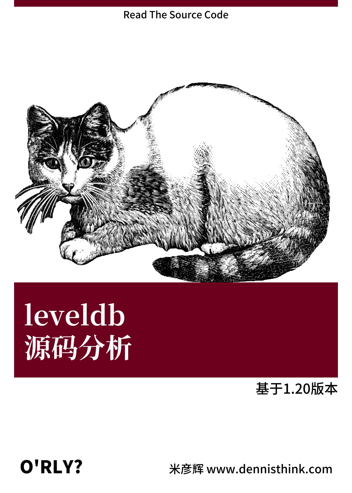

# Introduction

这本书是我的第一本电子书，也是对5年C++开发生涯做的一个总结。本书主要记录了我阅读leveldb的笔记，以及对于leveldb源代码的理解。

第一章简单的介绍了leveldb中使用到的基础类型，也会对存储结构做介绍。第二章主要介绍leveldb的主要操作的流程。第三章主要介绍leveldb的类的继承关系的设计。第四章介绍leveldb的测试用例的设计。

附录中介绍了在阅读代码的过程中使用的软件。类名称会对leveldb中的主要类以及所在文件做介绍，方便在阅读本书的时候与源码对照。

米彦辉

2018年11月26日于北京