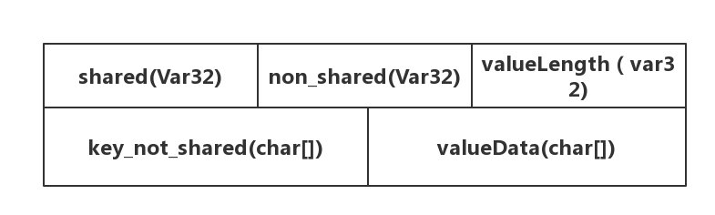

1.函数
void BlockBuilder::Add(const Slice& key, const Slice& value) 
使用的内存结构

2. Key分为UserKey,InternalKey,MemKeys
3. 分析一下叫带有Wrapper的类
4. Ref 和UnRef的类
5. 重点的类 Slice Status
6. Iterator
7. 弄清楚每个NewIterator返回的迭代器的类型