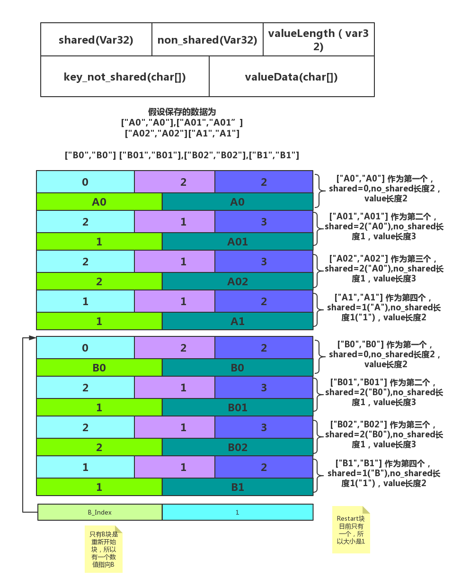

Block分为大块和小块，在下图中进行说明。

图1 Block存储结构的说明



## 1.数据设计分析:
1. shared,non_shared的设计，是为了更好节省空间。
2. Restarts的设计，主要是为了方便向上查找。

## 2.以上图为依据，分析BlockIter函数的实现。

### 1. *解析shared,non_shared,以及value_length*
```cpp
static inline const char* DecodeEntry(const char* p, const char* limit,
                                      uint32_t* shared,
                                      uint32_t* non_shared,
									uint32_t* value_length) {
  //至少需要3个字节
  if (limit - p < 3) return nullptr;
  *shared = reinterpret_cast<const unsigned char*>(p)[0];
  *non_shared = reinterpret_cast<const unsigned char*>(p)[1];
  *value_length = reinterpret_cast<const unsigned char*>(p)[2];
  
  
  if ((*shared | *non_shared | *value_length) < 128) {
    // Fast path: all three values are encoded in one byte each
    p += 3;
  } else {
    //依次解析
    if ((p = GetVarint32Ptr(p, limit, shared)) == nullptr) return nullptr;
    if ((p = GetVarint32Ptr(p, limit, non_shared)) == nullptr) return nullptr;
    if ((p = GetVarint32Ptr(p, limit, value_length)) == nullptr) return nullptr;
  }

  if (static_cast<uint32_t>(limit - p) < (*non_shared + *value_length)) {
    return nullptr;
  }
  return p;
}
```

### 2.*获取迭代器的前一个位置，先在大块中移动，然后在小块中移动*
```cpp
//获取迭代器的上一个
  virtual void Prev() {
    assert(Valid());

    // Scan backwards to a restart point before current_
    const uint32_t original = current_;
	//找到小块的开始位置
    while (GetRestartPoint(restart_index_) >= original) {
      if (restart_index_ == 0) {
        // No more entries
        current_ = restarts_;
        restart_index_ = num_restarts_;
        return;
      }
      restart_index_--;
    }
    //在当前的小块中找下一个
    SeekToRestartPoint(restart_index_);
    do {
      // Loop until end of current entry hits the start of original entry
    } while (ParseNextKey() && NextEntryOffset() < original);
  }
```

### 3.*获取指定的Key的位置*
```cpp
/**
   * @brief 查找target对应的值
   * @param target 被查找的Key
   */
  virtual void Seek(const Slice& target) {
    // Binary search in restart array to find the last restart point
    // with a key < target
	// 二分查找算法，排序在什么时候进行的呢？
	// 先进行大块的查找，此时使用二分查找法
    uint32_t left = 0;
    uint32_t right = num_restarts_ - 1;
    while (left < right) {
      uint32_t mid = (left + right + 1) / 2;
      uint32_t region_offset = GetRestartPoint(mid);
      uint32_t shared, non_shared, value_length;
      const char* key_ptr = DecodeEntry(data_ + region_offset,
                                        data_ + restarts_,
                                        &shared, &non_shared, &value_length);
      if (key_ptr == nullptr || (shared != 0)) {
        CorruptionError();
        return;
      }
      Slice mid_key(key_ptr, non_shared);
	  //排序是在什么时候进行的,在BlockBuilder中进行
      if (Compare(mid_key, target) < 0) {
        // Key at "mid" is smaller than "target".  Therefore all
        // blocks before "mid" are uninteresting.
        left = mid;
      } else {
        // Key at "mid" is >= "target".  Therefore all blocks at or
        // after "mid" are uninteresting.
        right = mid - 1;
      }
    }

    // Linear search (within restart block) for first key >= target
	// 在小块中查找，此时使用线性查找法
    SeekToRestartPoint(left);
    while (true) {
      if (!ParseNextKey()) {
        return;
      }
      if (Compare(key_, target) >= 0) {
        return;
      }
    }
  }
```