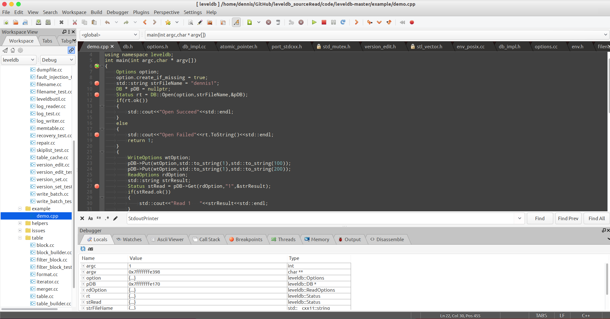
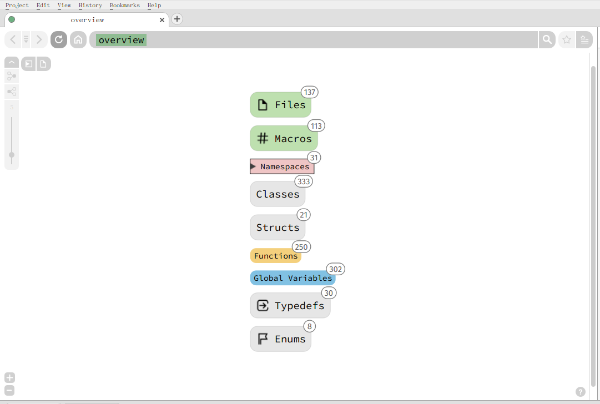
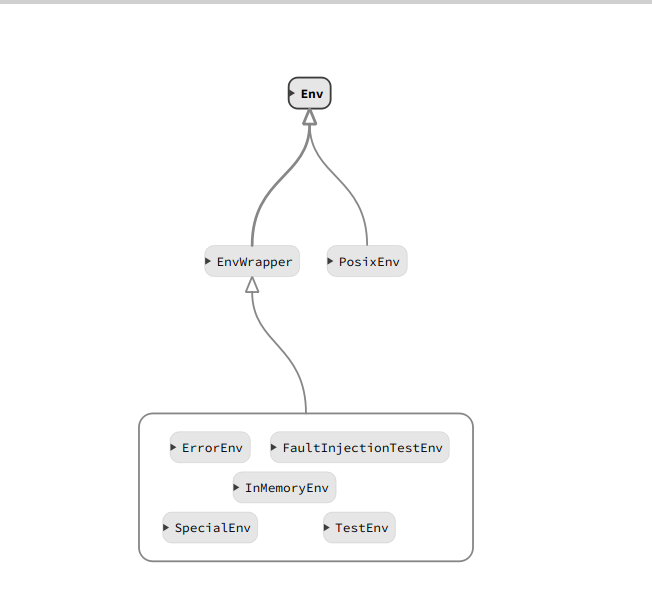
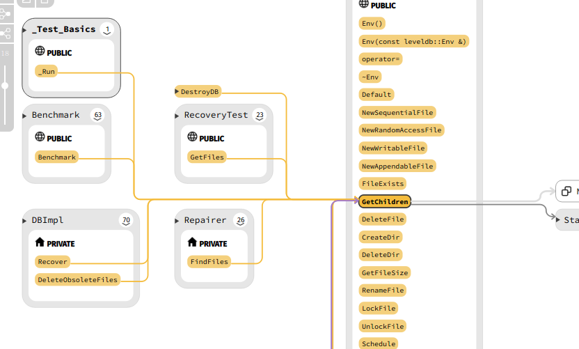

分析leveldb使用到的软件。

# 1.代码编译调试(CodeLite)
官方网站: https://codelite.org/


因为leveldb在windows的编译比较麻烦，所以我采用了在Linux编译运行的方式。CodeLite是在Linux比较好用的一个C/C++、PHP、Node.js的开发IDE。对于C++来说，这个IDE已经够用了，下面展示一下我的调试界面。


# 2.源码注释(CodeLite)
在阅读源码的过程中，我们需要给代码增加注释，CodeLite的右键支持生成Doxygen风格的注释，非常方便。

步骤如下:

右键选择
>Code Generation > Insert Doxygen Comment.

生成的效果如下：

```cpp
/**
 * @brief 从MemTable中查找key对应的value
 * @param key 被查找的key
 * @param value 生成的value
 * @param s 查找结果
 * @return 是否找到了
 */

bool MemTable::Get(const LookupKey& key, std::string* value, Status* s) {
```

# 3.源码阅读(SourceTrail)

官方网站:https://www.sourcetrail.com/

为了比较好的了解类和函数调用的关系，我们需要一个非常的好的代码阅读器。在这里我非常的推荐SourceTrail这个工具，它能够清楚的画出类之间的继承关系，函数的调用关系等。

整体浏览:


类继承:


函数调用



# 4.文档生成(Doxygen)
官网链接:http://www.doxygen.org/
Doxygen是一个根据代码生成文档的工具，支持的语言包括C,Object-C,C++,C#，PHP，JAVA，Python等。